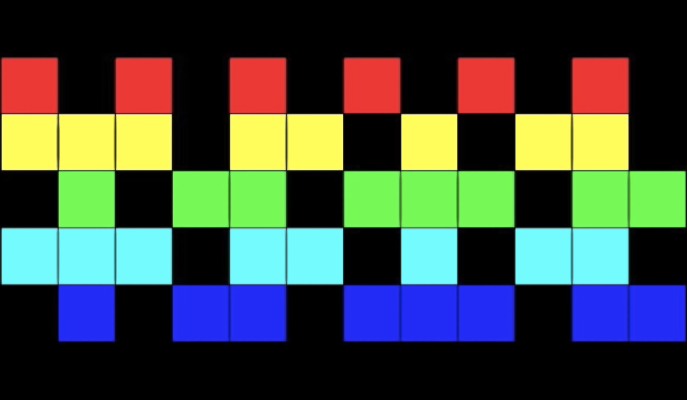

# gridscore

A system for creating grid-based musical scores.

## About

Gridscore creates grid-based musical scores like the one found on this youtube video:

https://www.youtube.com/watch?v=gy2kyRrXm2g

## State

Gridscore is in early development and still non-functional.

## Dependencies

https://svgjs.com/docs/3.0/
